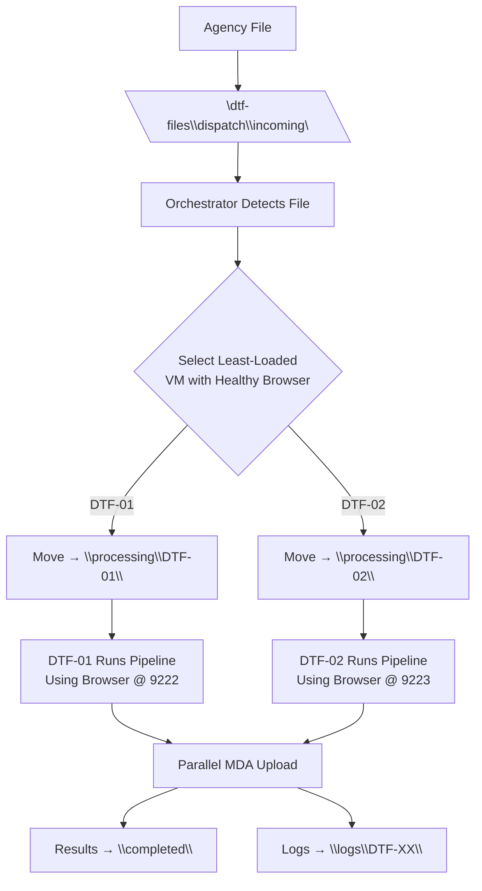

# DTF Distributed Orchestration – Technical Proposal
**Scaling the Data Transformation Framework to Parallel, Fault-Tolerant Operation**  
**Prepared for:** IT Infrastructure & Operations Team  
**Prepared by:** [Your Name]  
**Date:** October 29, 2025

---

## Goal
Transition the **Data Transformation Framework (DTF)** from a **single-node, serial execution model** to a **fully distributed, parallel, and self-healing architecture** capable of processing **hundreds of agency files concurrently** — **with one dedicated, persistent browser session per VM** — while maintaining **full transparency, auditability, and zero disruption** to existing transformation logic.

---

## Current Model
- **Single VM** hosting PowerShell, Node.js, and Zoho Catalyst automation
- **One browser session** handling all MDA uploads
- **Sequential file processing** via shared local folders
- **Reliable but fundamentally constrained** by:
  - Single-threaded execution
  - Single point of failure
  - No horizontal scaling path

---

## Proposed Model: *Distributed Orchestration*

### Key Components

| Component | Role | Implementation |
|------------|------|----------------|
| **Worker Nodes** | `DTF-01`, `DTF-02`, `DTF-03` | Identical, stateless, replaceable VMs running standard DTF stack |
| **Browser Session** | One per VM | Dedicated, persistent Chrome instance with remote debugging port (e.g. `9222`, `9223`, `9224`) — always open and monitored |
| **Orchestrator Node** | `DTF-Orchestrator` | Dedicated control plane that assigns jobs, monitors health, and checks browser connectivity |
| **Dispatch Zone** | Central ingestion point | `\\dtf-files\dispatch\incoming\` |
| **Processing Zones** | Per-node work queues | `\\dtf-files\dispatch\processing\DTF-XX\` |
| **Shared Outputs** | Consolidated results | `\\dtf-files\dispatch\completed\` and `\\dtf-files\dispatch\logs\DTF-XX\` |
| **Health Monitoring** | Heartbeat + browser status | HTTP POST every 15 seconds plus WebSocket check on debugging port |

---

## Flow Overview

1. File lands in Dispatch Zone  
2. Orchestrator checks VM health and browser connectivity  
3. File is atomically moved to the selected VM’s processing folder  
4. Worker detects file and executes unchanged DTF logic using its own browser  
5. Parallel uploads occur via dedicated sessions  
6. Outputs and logs are written with full VM traceability

---

## Browser Session Management (Per VM)

| Feature | Implementation |
|----------|----------------|
| **Persistent Browser** | Chrome launched at VM boot: `chrome.exe --remote-debugging-port=9222 --user-data-dir="C:\DTF\Browser\DTF-01" --no-first-run` |
| **Auto-Restart on Crash** | PowerShell watchdog: `while ($true) { if (!(Test-WS ws://localhost:9222)) { Restart-Browser } }` |
| **Orchestrator Awareness** | Heartbeat includes `"browser_connected": true` |
| **Session Isolation** | Unique port and user-data-dir per VM → no cookie/session bleed |
| **Failover** | If browser disconnects, VM is paused from job assignment until restored |

**Parallelism:** one browser per VM → true concurrency with zero interference.

---

## Redundancy and Fault Tolerance

| Failure Mode | Detection | Automatic Recovery |
|---------------|------------|--------------------|
| Worker VM offline | Heartbeat timeout (30s) | Orchestrator removes from pool and redistributes load |
| Browser session crash | WebSocket disconnect on debug port | VM auto-restarts browser and signals `browser_disconnected`; paused from assignment |
| Orchestrator failure | N/A (temporary) | Workers finish in-flight jobs; new files queue safely in incoming |
| File in transit | Atomic move | No partial processing — file stays in incoming until claimed |

✅ **No data loss**  
✅ **No manual browser restarts**  
✅ **Full audit trail preserved**

---

## Benefits

| Benefit | Business Impact |
|----------|-----------------|
| **True parallel uploads** | 3–5× throughput via three dedicated browser sessions |
| **Built-in redundancy** | Survives VM or browser failure |
| **Self-healing sessions** | Zero manual intervention |
| **End-to-end traceability** | Every log tagged, e.g. `DTF-03 – Upload Success (Browser 9224)` |
| **Zero-code-change scaling** | Existing DTF scripts run unmodified |
| **Clone-and-go expansion** | Add VM and browser to scale instantly |
| **Safe isolation** | Dev/test VMs can run offline |
| **Cloud migration ready** | Direct path to SQS and serverless workers |

---

## Diagram: Distributed Transformation Architecture
 

Each VM runs one persistent, monitored browser → true parallel MDA uploads.

---

## Infrastructure Requirements

| Resource | Specification |
|-----------|---------------|
| **Total VMs** | 4 |
| **DTF-Orchestrator** | 1 vCPU, 2 GB RAM, Windows/Ubuntu, Node.js |
| **DTF-01/02/03** | Clone from current DTF VM, 2+ vCPU, 8+ GB RAM |
| **Browser per Worker** | Chrome with remote debugging: Ports `9222–9224` User-data-dir: `C:\DTF\Browser\DTF-XX` |
| **Shared Storage** | SMB share: `\\dtf-files\dispatch` Subfolders: `incoming`, `processing\DTF-XX`, `completed`, `logs` |
| **Drive Mapping** | Mount as `Z:` on all four VMs |
| **Network** | Same subnet Ports 9222–9224 open from workers Port 3000 open to Orchestrator |
| **Golden Image** | Snapshot of current DTF VM with browser pre-installed and configured |

---

## Implementation Timeline (2 Weeks)

| Week | Milestones |
|-------|-------------|
| **Week 1** | - Provision 4 VMs - Configure SMB share and `Z:` mount - Pre-install Chrome and debugging ports - Deploy Orchestrator service |
| **Week 2** | - Clone worker image → DTF-01/02/03 - Deploy browser watchdog and startup scripts - Execute 3 parallel test jobs - Validate failover (kill browser, VM) |

---

## Risks and Mitigations

| Risk | Likelihood | Mitigation |
|------|-------------|------------|
| Browser session drift | Low | Isolated user-data-dir + auto-restart |
| Port conflict | Low | Fixed port mapping per VM |
| SMB I/O bottleneck | Low | Use SSD storage; monitor with PerfMon |
| Orchestrator SPOF | Medium | Auto-restart script; future HA pair |

---

## Approval and Next Steps

Requesting IT to provision:

1. **1 × DTF-Orchestrator VM**  
2. **3 × Worker VMs (DTF-01 to DTF-03)** cloned from the current DTF VM  
3. **Chrome installed** on each worker with:
   - Remote debugging port (9222, 9223, 9224)
   - Dedicated user-data-dir
   - Auto-start at boot
4. **1 × SMB share:** `\\dtf-files\dispatch` with required subfolders
5. **Network access:** Ports 9222–9224 (worker → self), 3000 (→ Orchestrator)
6. **Z:** drive mapped on all VMs

**Upon completion, the development team will:**
- Deploy Orchestrator and worker scripts
- Validate three parallel browser uploads
- Deliver performance report (3× baseline)

---

**Approved by:**  
IT Manager  
Date: _____________________

**Approved by:**  
Project Owner  
Date: _____________________

---

**This proposal delivers:**  
✅ Parallel Browser Uploads · ✅ Self-Healing Sessions · ✅ Linear Scaling · ✅ Future-Proof Design

> Let’s build the next-generation DTF platform — with true parallel power.
